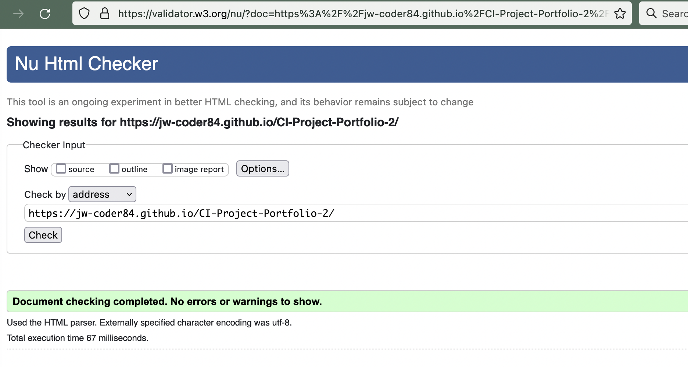
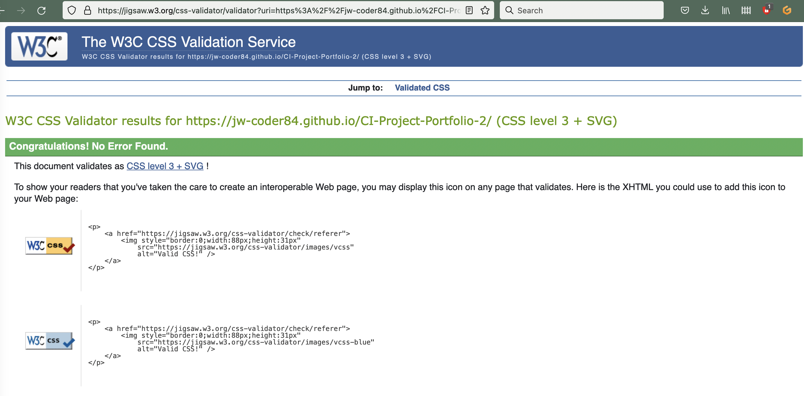
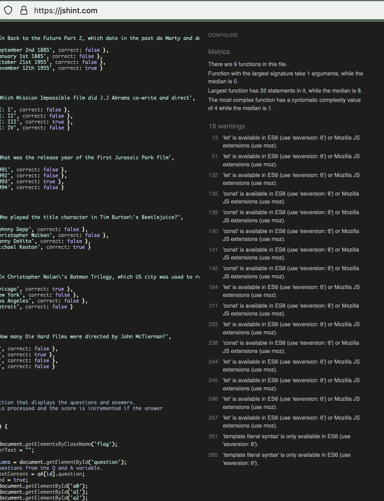

# **_Movie Quiz - Project Portfolio 2_**

The purpose of this website is to run a general knowledge quiz on various films. 

## [View website](https://jw-coder84.github.io/CI-Project-Portfolio-2/)

# Contents

* [Objective](#objective)
* [User Experience (UX)](#user-experience-ux)
    * [Design Prototype](#design-prototype)
        * [Wireframes](#wireframes)
    * [Site Structure](#site-structure)
    * [Design Choices](#design-choices)
        * [Fonts](#fonts)
        * [Colour Scheme](#colour-scheme)
* [Features](#features)
    * [Future Implementations](#future-implementations)
* [Technologies Used](#technologies-used)
* [Testing](#testing)
    * [Code Validation](#code-validation)
        * [HTML](#html)
        * [CSS](#css)
        * [JavaScript](#javascript)
    * [Issues that were encountered during testing](#issues-that-were-encountered-during-testing)
    * [HTML Validator Issues](#html-validator-issues)
    * [Contact Form](#contact-form)
* [Deployment](#deployment)
* [Credits](#credits)

# Objective

To run a quiz that enables the user to answer each question and move to the next until the end, scoring points for each right answer.

[Back to contents](#contents)

# User Experience (UX)

## Design Prototype
* The wireframe images below were created using Balsamiq Wireframes. The site layout was simple and contained so no changes were required for a tablet size screen. The layout only needed to change for mobile screen sizes.
* I ended up using one background image for the question and answer area.
* The end page was not implemented as I didn't have time but could be for a future feature.
* The question number was also not shown on the final design.

 
 
 
 

## Site Structure
The site has a landing page with a 'play' button to initiate the quiz. The quiz content (questions, answers, buttons) appears in the center of the additional page.

## Design Choices

### Fonts
The Google font Special Elite was used for the site with cursive being used as an alternate if the primary font can't be used.

### Colour Scheme
I chose a high contrast background and text colours. 

* Background colour: #363E45
* Text colour: #ffffff

[Back to contents](#contents)

# Features

* The hompage shows the logo, introduction text and 'play' button to begin the quiz.
 

<b>Home page - logo and play button</b>

 

* The quiz page shows the question, possible answers and two buttons. The 'next question' button is initially inactive.
* The 'answer' button is used to enter the selected answer. Once this has been done, the 'next question' button becomes active and can be used to proceed to the next question.
* Once an answer is selected, the other answers become inactive.
* The flag div will show 'Correct!' or 'Wrong' depending on the chosen answer.
* The score is incremented for every correct answer.
* On the last question the 'next question' button changes to 'Finish' and returns the user to the home page.
 

<b>Quiz page - questions, answers, buttons, score and correct/wrong indicator</b>

 

## Future Implementations
* When all the questions have been answered, the user is taken to a page which shows which questions they got right and wrong. On the wrong answered, the right answers would be shown.
* Add more questions and arrange them into categories and or difficulties which the user can select before they start.
* Let users register so high scores can be saved and shown on a list.

[Back to contents](#contents)

# Technologies used
* [HTML5](https://en.wikipedia.org/wiki/HTML5) - The structure of the site content.
* [CSS](https://en.wikipedia.org/wiki/CSS) - The styling and positioning of the content.
* [JavaScript](https://en.wikipedia.org/wiki/JavaScript) - The programming of the quiz functionality.
* [Google Fonts](https://fonts.google.com/) - Font resource used for the logo.
* [Balsamiq](https://balsamiq.com/) - Wireframe sofware.
* [Github](https://github.com/) - Version control and host of project file repository.
* [Gitpod](https://gitpod.io) - Development environment.
* [Am I Responsive](https://ui.dev/amiresponsive) - Responsive design image
* [Font Awesome](https://fontawesome.com/) - For the cinema / film related icons.

[Back to contents](#contents)

# Testing
* Firefox browser and inspector tool were used to test the CSS styling code and the layout of the elements. Console logs of JavaScript and other details were viewed in the inspector when debugging the code.

# Code Validation
The website HTML and CSS code was validated using tools from W3C. The JavaScript was validated using JSHint.
### HTML
 

<b>HTML validation check</b>

 

### CSS
 

<b>CSS validation check</b>

 

### JavaScript
 

<b>JavaScript validation check</b>

 

## Issues that were encountered during testing
* The question and answers wouldn't display. The flag div html content was set to "" by default. I wrapped this around the game-area div which had the question and answer content. I wanted to have the flag div border change to red or green in indicate a wrong or right answer, surrounding the game-area div. This was erasing the content of all the child elemets of the flag div including the game-area. 
This prevented the quiz from running.
* The score would not increment by one. It increments by 1 then 2 then 3 and so on, up to 10. The max score that can be acheived is 55. I didn't have time to resolve this.

## JavaScript validator issues
* I missed some semi colons that didn't affect the running of the code. I'd re-declared some variable where they were not needed so removed them.

[Back to contents](#contents)

# Deployment
The website was deployed by the following steps:
* From the GitHub repository page, click settings.
* Click pages and under source select the main branch from the dropdown and then click save.
* The site will then be published with the URL provided.

To run from your local machine:
* The GitHub repository can be cloned to another account, detailed [here](https://docs.github.com/en/repositories/creating-and-managing-repositories/cloning-a-repository).

[Back to contents](#contents)

# Credits
* Quiz answers 
* [IMDB](https://www.imdb.com/)

* The JavaScript ONLY was used and adapted from the following site:
* [Simple JavaScript quiz](https://www.geeksforgeeks.org/how-to-create-a-simple-javascript-quiz/)

* The score increment code was taken from the Love Maths Code Institute walkthrough project.

* The quiz page background image and image for the favicon icon were taken from the following site:
* [Free stock images](https://www.stockvault.net)

* Favicon image generator:
* [Favicon generator](https://favicon.io/)

* The WebAIM contrast checker was used for the colours of my site.
* [WebAIM contrast checker](https://webaim.org/resources/contrastchecker/)