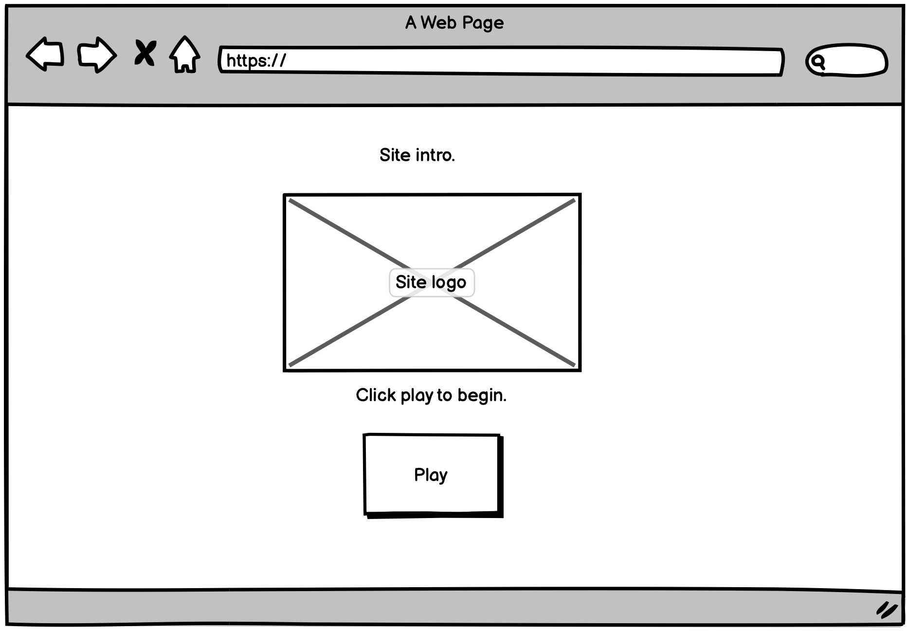
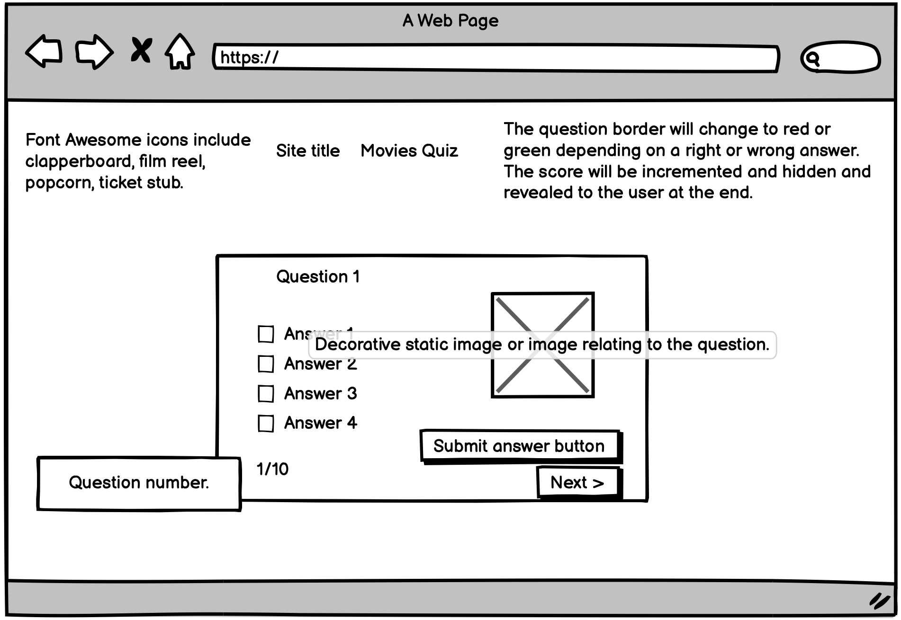
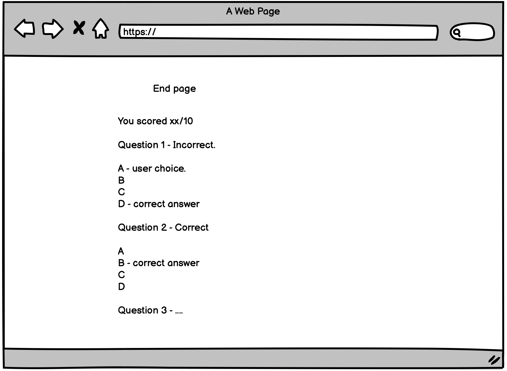
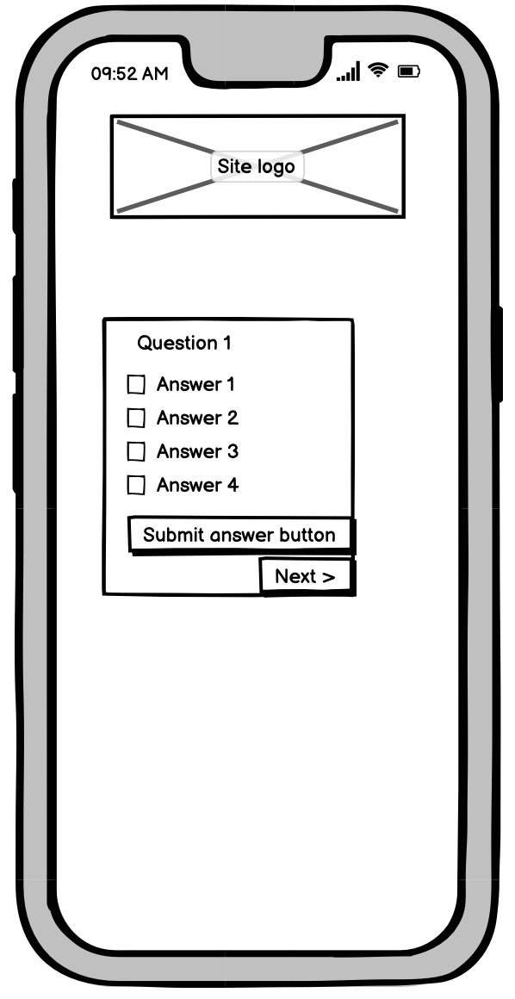
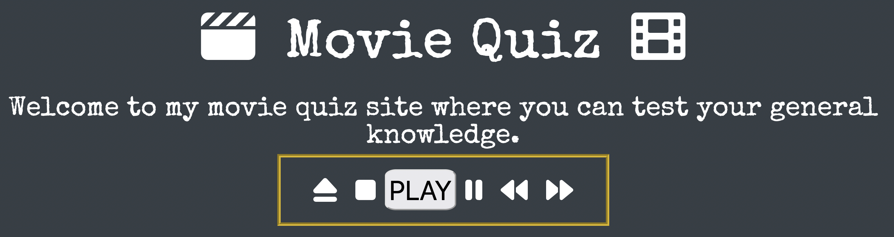
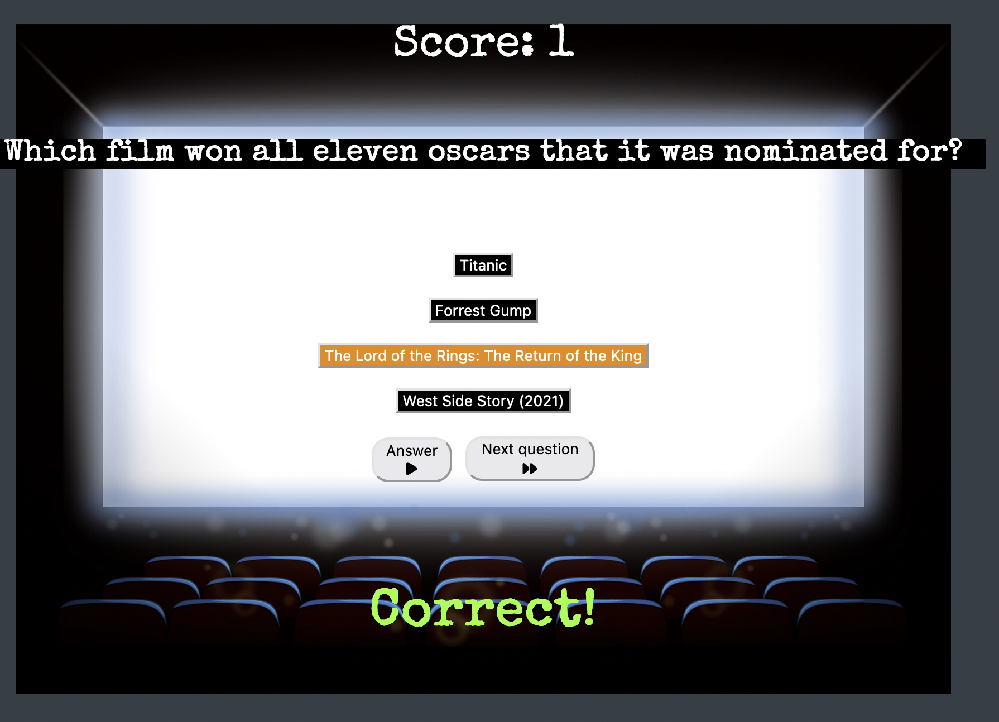

# **_Movie Quiz - Project Portfolio 2_**

The purpose of this website is to run a general knowledge quiz on various films. 

## [View website](https://jw-coder84.github.io/CI-Project-Portfolio-2/)

# Contents

* [Objective](#objective)
* [User Experience (UX)](#user-experience-ux)
    * [Design Prototype](#design-prototype)
        * [Wireframes](#wireframes)
    * [Site Structure](#site-structure)
    * [Design Choices](#design-choices)
        * [Fonts](#fonts)
        * [Colour Scheme](#colour-scheme)
* [Features](#features)
    * [Future Implementations](#future-implementations)
* [Technologies Used](#technologies-used)
* [Testing](#testing)
    * [Code Validation](#code-validation)
        * [HTML](#html)
        * [CSS](#css)

# Objective

To run a quiz that enables the user to answer each question and move to the next until the end, scoring points for each right answer.

[Back to contents](#contents)

# User Experience (UX)

## Design Prototype
* The wireframe images below were created using Balsamiq Wireframes. The site layout was simple and contained so no changes were required for a table size screen. The layout only needed to change for mobile size screens.
* I ended up using one background image for the question and answer area.
* The end page was not implemented as I didn't have time but could be for a future feature.

 
 
 
 

## Site Structure
The site has a landing page with a 'play' button to initiate the quiz. The quiz content (questions, answers, buttons) appears in the center of the additional page.

## Design Choices

### Fonts
The Google font Special Elite was used for the site with cursive being used as an alternate if the primary font can't be used.

### Colour Scheme
I chose a high contrast background and text colours. 

* Background colour: #363E45
* Text colour: #ffffff

[Back to contents](#contents)

# Features

* The hompage shows the logo, introduction text and 'play' button to begin the quiz.
 

<b>Home page - logo and play button</b>

 

* The quiz page shows the question, possible answers and two buttons. The 'next question' button is initially inactive.
* The 'answer' button is used to enter the selected answer. Once this has been done, the 'next question' button becomes active and can be used to proceed to the next question.
* Once an answer is selected, the other answers become inactive.
* The flag div will show 'Correct!' or 'Wrong' depending on the choesn answer.
* The score is incremented for every correct answer.
* On the last question the 'next question' button changes to 'Finish' and returns the user to the home page.
 

<b>Quiz page - questions, answers, buttons, score and correct/wrong indicator</b>

 

## Future Implementation
