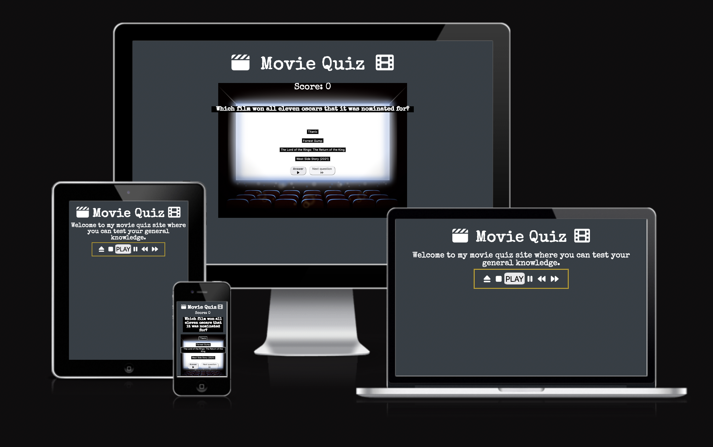

# **_Movie Quiz - Project Portfolio 2_**

The purpose of this website is to run a general knowledge quiz on various films. 

## [View website](https://jw-coder84.github.io/CI-Project-Portfolio-2/)

# Contents

* [Objective](#objective)
* [User Experience (UX)](#user-experience-ux)
    * [Design Prototype](#design-prototype)
        * [Wireframes](#wireframes)
    * [Site Structure](#site-structure)
    * [Design Choices](#design-choices)
        * [Fonts](#fonts)
        * [Colour Scheme](#colour-scheme)
* [Features](#features)
    * [Future Implementations](#future-implementations)
* [Technologies Used](#technologies-used)
* [Testing](#testing)
    * [Code Validation](#code-validation)
        * [HTML](#html)
        * [CSS](#css)

# Objective

To run a quiz that enables the user to answer each question and move to the next until the end, scoring points for each right answer.

[Back to contents](#contents)

# User Experience (UX)

## Design Prototype
